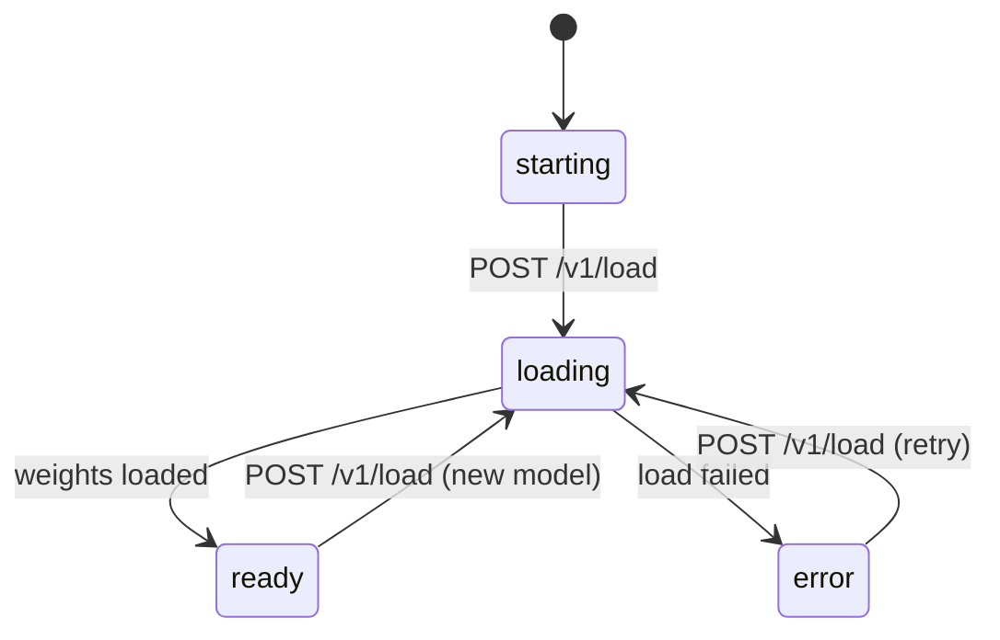

# Backend Protocol

A **backend** is an out-of-tree text-to-speech implementation that the
daemon loads at runtime instead of compiling in. This document defines the
daemon↔backend contract that every backend implements, regardless of how it
is packaged.

The contract is HTTP-shaped and identical for all backends. Only the
*transport* differs: a backend ships either as a WASM component the daemon
invokes in-process, or as a native subprocess the daemon spawns and talks to
over a Unix socket. Authors pick the transport; the routes, payloads, and
lifecycle below do not change.

This document is the companion to:

- [config.md](./config.md) — the `backend.toml` every
  backend ships, and the fields the daemon reads to discover it.
- [wasm.md](./wasm.md) — WASM component backends (cloud /
  API, lightweight CPU).
- [subprocess.md](./subprocess.md) — native subprocess
  backends (local models, GPU).
- [transport.md](../transport.md) — the external client↔daemon wire shape,
  which the backend contract mirrors.

## Model identity

A model is identified by the `(name, source)` pair — the same
pair external clients use on
[`/pipeline/{stage}/model`](../endpoints/v1/pipeline/model.md):

| Field      | Type   | Notes                                                                       |
|------------|--------|-----------------------------------------------------------------------------|
| `name`     | string | Wire model name, e.g. `kokoro-82m`, `xtts-v2`, `nova-3`.             |
| `source`   | string | The **backend repository** that provides the model — a canonical repo id declared in the backend's configuration. |

`source` names *which backend* a model comes from. Two backends may both
implement `kokoro-82m`; they coexist and are
disambiguated by `source`. The daemon derives a model's `source` from the
`[backend].source` field of the configuration that declares it — see
[config.md](./config.md).

> `source` supersedes the older `builtin | custom | online` discriminator.
> [pipeline/model.md](../endpoints/v1/pipeline/model.md) and
> [pipeline/model-list.md](../endpoints/v1/pipeline/model-list.md) are
> reconciled with this definition.

> `[backend].id` is a separate identifier that names a backend's install
> directory. It is not part of model identity.

## Transports

| Concern             | WASM backend                            | Subprocess backend                       |
|---------------------|-----------------------------------------|------------------------------------------|
| Use for             | Cloud / API models, light CPU work      | Local models, GPU inference              |
| Delivery            | In-process component invocation         | HTTP/SSE over a pathname Unix socket     |
| Contract exposure   | Exports `wasi:http/incoming-handler`    | Serves the `/v1` routes as an HTTP server |
| Network egress      | `wasi:http/outgoing-handler`, allowlisted | None — the process is network-isolated  |
| Sandbox             | wasmtime capability model               | systemd hardening + seccomp              |
| Specification       | [wasm.md](./wasm.md)            | [subprocess.md](./subprocess.md) |

Both deliver the same `/v1` request/response payloads. A WASM backend
receives an HTTP `Request` by direct in-process invocation; a subprocess
backend receives it over its socket. Nothing else about the contract
changes.

## The `/v1` contract

Every backend exposes these routes under the `/v1` prefix. Payloads follow
the envelope convention from [transport.md](../transport.md): responses carry
a top-level `status` field of `"success"` or `"error"`.

| Method | Route            | Purpose                                            |
|--------|------------------|----------------------------------------------------|
| POST   | `/v1/load`       | Load a model variant; drives readiness to `ready`. |
| GET    | `/v1/status`     | Readiness state and load progress.                 |
| GET    | `/v1/ping`       | Liveness.                                          |
| POST   | `/v1/synthesize` | Synthesize speech; streams framed audio.           |
| POST   | `/v1/cancel`     | Cancel an in-flight synthesis.                     |
| POST   | `/v1/voices`     | Register a cloned voice's reference audio.†        |
| DELETE | `/v1/voices/{voice}` | Release a registered cloned voice.†            |

† Only for models declaring `cloned` in
[`voice_kinds`](./config.md#modelsvoices). A backend whose models are all preset or
described never receives these calls and need not implement them.

### Contract generations and the `/v1` prefix

The manifest's [`contract`](./config.md#contract-generations) names a
*generation* of this agreement — which fields a `backend.toml` may declare and
which routes exist to be served. Each generation extends the one before it.
`v1` is the only generation so far, and it is everything on this page.

A generation does not oblige a backend to serve all of it. What a backend must
implement follows from the models it declares, not from the generation it
names: a backend whose models are all preset or described serves
`POST /v1/synthesize` and never `POST /v1/voices`, and is no less a `v1`
backend for it.

The `/v1` in the route paths is not that number. It is a path segment inside
the agreement, and an extending generation leaves it alone: a future `v2`
backend would serve whatever `v2` adds *next to* `/v1/synthesize`, renaming
nothing. The prefix would move only for a generation that changed the shape of
a route that already exists — which is the case a new generation is meant to
avoid needing.

### Request headers

On every `/v1` request the daemon injects context as request headers; a
backend reads what it needs and ignores the rest. The daemon owns these
headers — external clients cannot set them.

| Header                | Carries                                                  |
|-----------------------|----------------------------------------------------------|
| `x-tts-model`         | The active model name, e.g. `kokoro-82m`.                |
| `x-tts-secret-<name>` | One declared secret, e.g. `x-tts-secret-OPENAI_API_KEY`. |
| `x-tts-option-<name>` | One declared option, e.g. `x-tts-option-base_url`.       |

- `x-tts-model` names the model to synthesize with. The daemon also calls
  [`POST /v1/load`](#post-v1load) with the model before routing, but a
  stateless backend (re-instantiated per request — see [wasm.md](./wasm.md))
  reads `x-tts-model` on each request instead of remembering the load; a
  stateful backend may rely on `load` and ignore the header.
- Secrets and options come from the backend's [configuration](./config.md),
  with values set by the user in the settings UI. The header for a secret or
  option the user has not set is omitted.
- `x-tts-option-base_url` is the one option header the daemon normalizes. It
  carries a canonical `scheme://host[:port][/path]`: lowercase scheme, no
  userinfo, no trailing slash, no query or fragment, and a port only when the
  user set one. A backend can split it at the first `/` after the scheme and
  needs no further parsing. Every other option is passed through exactly as the
  user set it. See [config.md — `base_url` and egress](./config.md#base_url-and-egress).
- **Secret values are sensitive.** The daemon stores them encrypted and
  redacts the `x-tts-secret-*` headers from logs. A backend uses a secret only
  to authenticate its own outbound calls — it must never echo one in a
  response or forward the injected header upstream. An OpenAI backend reads
  `x-tts-secret-OPENAI_API_KEY` and sets its own `Authorization: Bearer`
  header on the request to `api.openai.com`.
- Option values are not sensitive and are stored as plaintext.

### `POST /v1/load`

Load one model variant. The daemon has already provisioned the model's files
into the backend's directory (see [Lifecycle](#lifecycle)); the backend
resolves them from the `dest` paths in its own configuration. The call returns
`202` immediately and the load proceeds asynchronously — progress is read
from [`GET /v1/status`](#get-v1status).

A backend serves exactly one model at a time. Switching models is a fresh
`load` after the daemon has torn the backend down and spawned it again.

**Every backend must implement `/v1/load`.** A backend with nothing to load —
e.g. a cloud backend that holds no local weights — treats it as a no-op: it
acknowledges with `202` and reports `ready` from `GET /v1/status` immediately.
The daemon always calls `load` before routing synthesis, so the route
must exist even when it does no work.

**Request:**

```http
POST /v1/load HTTP/1.1
Host: backend.local
Content-Type: application/json

{
  "name":     "kokoro-82m",
  "device":   "cuda"
}
```

| Field      | Type   | Required | Notes                                                          |
|------------|--------|----------|----------------------------------------------------------------|
| `name`     | string | yes      | A model `name` the backend declares in its configuration.           |
| `device`   | string | no       | The resolved accelerator for this load: `cpu`, `cuda`, `rocm`, `metal`, or `vulkan`. This is the accelerator the installed asset actually targets, not the user's `cpu`/`gpu` preference — the daemon resolves that preference against the asset it selected, so a build carrying more than one runtime is told which one to use. The same resolution is what external clients see as `resolved_accel` on [`GET`/`POST /pipeline/{stage}/model/{model}/device`](../endpoints/v1/pipeline/device.md). **Absent** when the daemon has no record of which accelerator the installed build targets — an install performed from a local directory, for instance — in which case the backend selects for itself. The backend may still fall back; the actual device is reported by `GET /v1/status`. |
| `provider` | string | no       | Present only when the model declares [`provider`](./config.md#models) in its configuration, echoed back verbatim. Carries no meaning to the daemon. |

> **Compatibility.** `provider` was part of model identity before it became
> `(name, source)`. Backends released against the earlier contract reject a
> load whose `provider` does not match their own fixed value, so the daemon
> still forwards the key for any model whose manifest declares it. A new
> backend should ignore it: identity is `name`, and the daemon spawns one
> backend per model.

**Response (202):**

```http
HTTP/1.1 202 Accepted
Content-Type: application/json

{ "status": "success", "message": "Loading started" }
```

**Errors:**

| HTTP | `message`            | Meaning                                                       |
|------|----------------------|---------------------------------------------------------------|
| 400  | `invalid_model`      | `name` is not implemented by this backend.                    |
| 409  | `already_loading`    | A load is already in progress.                                |
| 503  | `device_unavailable` | The requested device cannot be initialized.                   |

### `GET /v1/status`

Report readiness. `state` is the backend's readiness; `status` is the
envelope outcome — they are distinct: `status` is `"success"` whenever the
status report itself is valid, even while `state` is `"loading"` or
`"error"`.

**Request:**

```http
GET /v1/status HTTP/1.1
Host: backend.local
```

**Response (200):**

```jsonc
{
  "status":   "success",   // envelope outcome: "success" | "error"
  "state":    "loading",   // readiness: "starting" | "loading" | "ready" | "error"
  "progress": 0.42,        // present only while state == "loading"; 0.0–1.0
  "model": {               // present once a load has been requested
    "name": "kokoro-82m"
  },
  "device":   "cuda",      // actual device in use: "cpu" | "cuda" | "rocm" | "metal" | "vulkan"
  "reason":   null         // machine-readable cause; set when state == "error"
}
```

| Field      | Type    | Notes                                                                       |
|------------|---------|-----------------------------------------------------------------------------|
| `state`    | string  | `starting` (spawned, no load yet), `loading`, `ready`, or `error`.          |
| `progress` | number? | Load progress `0.0`–`1.0`; present only while `state` is `loading`.         |
| `model`    | object? | The model being loaded or loaded; absent in `starting`.                     |
| `device`   | string? | Device actually in use, one of `cpu`, `cuda`, `rocm`, `metal`, `vulkan`; present once `ready`. |
| `reason`   | string? | Machine-readable failure cause; present only when `state` is `error`.       |

`state` transitions:



A load that fails must end in `error` with a `reason`, however it failed: a
returned error, a panic, a thread that died. Catch a panic where the load
runs rather than letting it end the loading thread quietly. A backend left
reporting `loading` after its load can no longer finish gives the daemon
nothing to act on: it waits out its ten-minute load budget, then fails the
load with the backend's recent output. A backend that exits mid-load fails
the load at the daemon's next poll, with the same output.

The daemon routes synthesis to a backend only while `state` is `ready`.

### `GET /v1/ping`

Liveness. A successful response means the backend is running and serving the
contract; it says nothing about whether a model is loaded — use
`GET /v1/status` for that.

**Response (200):**

```http
HTTP/1.1 200 OK
Content-Type: application/json

{ "status": "success", "message": "pong" }
```

### `POST /v1/synthesize`

Turn text into audio. This is the only route that produces sound, and the only
one whose response is not JSON.

The daemon has already done the text work by the time this arrives: markup is
normalized away, `auto` is resolved to a concrete language, and long input is
split on sentence boundaries to the model's `max_input_chars`. A backend
receives **one prosodic unit** it can synthesize as written.

**Request:**

```jsonc
{
  "text":         "The kettle is boiling.",  // required, non-empty
  "voice":        "af_heart",                // optional; a voice this model declares
  "language":     "en",                      // optional; never the string "auto"
  "speed":        1.0,                       // optional rate multiplier
  "instructions": "Read this calmly."        // optional delivery guidance
}
```

| Field          | Type   | Required | Notes                                                                                  |
|----------------|--------|----------|----------------------------------------------------------------------------------------|
| `text`         | string | yes      | One prosodic unit, already normalized.                                                 |
| `voice`        | string | no       | A voice id from the model's manifest. Omitted → use `default_voice`.                   |
| `language`     | string | no       | Resolved BCP-47 tag. **Never `auto`** — the daemon owns detection, because it owns the text. |
| `speed`        | number | no       | Rate multiplier, roughly 0.5–2.0. A backend that cannot vary rate **ignores it**; do not resample to fake it, the daemon does not either. |
| `instructions` | string | no       | Free-text delivery guidance for models that accept it. Ignore it otherwise.            |

Optional fields are **omitted**, not sent as `null`, so a backend can
distinguish "unset" without special-casing.

**Response (200):** a stream of length-prefixed binary frames.

```http
HTTP/1.1 200 OK
Content-Type: application/vnd.super-tts.frames
x-tts-sample-rate: 24000
x-tts-channels: 1
x-tts-format: s16le
```

The three `x-tts-*` headers describe every audio frame in the body and are
required. `x-tts-format` is `s16le` or `f32le`; `x-tts-channels` is `1` or `2`;
`x-tts-sample-rate` is in Hz. The daemon resamples and channel-maps to whatever
the output device wants, so emit whatever your model produces natively.

Each frame is:

```
[u8 kind][u32 length, little-endian][payload…]
```

| `kind` | Name    | Payload                                                                 |
|--------|---------|-------------------------------------------------------------------------|
| `0x01` | `audio` | PCM samples in the declared format. Any length; frames need not align to sample boundaries. |
| `0x02` | `mark`  | JSON: `{ "start_ms"?, "end_ms"?, "start_char"?, "end_char"? }` — aligns a span of audio to a span of the request text. All fields optional. |
| `0x03` | `done`  | Empty. **Terminates the stream**; required.                             |
| `0x04` | `error` | JSON: `{ "message": "…" }`. Terminates the stream.                      |

Emit `audio` frames as they are produced rather than buffering the whole
utterance — the daemon starts playing as soon as it has enough to cover the
device's prebuffer, so streaming is what makes speech start quickly.

A stream **must** end with `done` or `error`. A body that ends without one is
rejected as truncated, because there is no other way to distinguish "the
backend finished" from "the connection dropped mid-utterance".

**Limits.** A single frame is capped at **1 MiB** and the cumulative audio of
one response at **32 MiB**. Exceeding either aborts the response. These bound
what a backend can make the daemon hold; they are not a quality limit — 32 MiB
is over five minutes of 24 kHz mono `s16le`, and the daemon chunks long text
into several requests anyway.

**Errors:**

| HTTP | `message`              | Meaning                                                 |
|------|------------------------|---------------------------------------------------------|
| 400  | `invalid_text`         | `text` is missing or empty.                             |
| 400  | `unsupported_language` | `language` is not in the model's `supported_languages`.  |
| 400  | `unknown_voice`        | `voice` is not a voice this model declares.             |
| 409  | `not_ready`            | No model is loaded; check `GET /v1/status`.             |
| 500  | `inference_failed`     | The backend failed during inference.                    |

Errors before the first frame use the JSON envelope with these codes. Once the
framed response has started, a late failure is an in-band `error` frame instead
— the status line has already been sent.

### `POST /v1/cancel`

Cancel the in-flight synthesis, if any. The corresponding `/v1/synthesize`
response terminates — with an `error` frame if the body has already started, or
by closing. Returns `409 nothing_in_progress` when no synthesis is running.

**Response (200):**

```http
HTTP/1.1 200 OK
Content-Type: application/json

{ "status": "success", "message": "Cancelled" }
```

### `POST /v1/voices`

Register a cloned voice's reference audio, so later syntheses can name it by id
alone. Only reached for a model declaring `cloned` in
[`voice_kinds`](./config.md#modelsvoices).

**Called once per voice per load, not per synthesis.** Deriving a speaker
embedding — or encoding reference codes — is real work, and the daemon issues
one `/v1/synthesize` per sentence, so a per-request push would repeat it for
every sentence of a paragraph. The backend derives what it needs once, keys it
by `voice`, and holds it for the life of the loaded model. Nothing has to
survive a restart: the daemon re-registers after every load.

**Request:**

```jsonc
{
  "voice":       "voice:2f8a2d0e-9c31-4e77-b0aa-1c6b2f0a51d4", // required
  "transcript":  "The quick brown fox…",                       // optional
  "sample_rate": 24000,
  "channels":    1,
  "format":      "s16le",
  "audio":       "<base64 PCM>"                                // required
}
```

| Field         | Type   | Required | Notes                                                                                     |
|---------------|--------|----------|-------------------------------------------------------------------------------------------|
| `voice`       | string | yes      | The full wire id, prefix included. **The same string a later `/v1/synthesize` sends as `voice`** — key the cache by it and no mapping is needed. |
| `transcript`  | string | no       | What the clip says. Present when the voice was stored with one; **guaranteed** present when the model declares `clone_needs_transcript`, because the daemon refuses to register a transcript-less clip against such a model. |
| `sample_rate` | number | yes      | Always `24000` today; read it rather than assuming.                                        |
| `channels`    | number | yes      | Always `1` today.                                                                          |
| `format`      | string | yes      | Sample format in the `x-tts-format` vocabulary; always `s16le` today.                      |
| `audio`       | string | yes      | Base64 of the raw PCM, already downmixed, resampled, and trimmed to the model's `clone_ref_seconds`. |

The audio is base64 inside JSON rather than a raw body so this route parses
like every other one on the contract — it happens once per voice, where the
third of encoding overhead costs nothing and a second parsing path would cost a
backend author real work.

The clip has already been trimmed to `clone_ref_seconds`; a backend does not
need to enforce its own bound, though refusing audio it genuinely cannot use is
always allowed.

**Response (200 or 201):**

```http
HTTP/1.1 200 OK
Content-Type: application/json

{ "status": "success" }
```

Any other status is a failure, and its `message` or `detail` reaches the user
as the reason speaking in that voice did not work.

### `DELETE /v1/voices/{voice}`

Release a registered cloned voice — sent when the user deletes one while the
model holding it is still loaded. `{voice}` is the percent-encoded wire id, so
the `voice:` prefix travels as one path segment whatever a router does with a
raw colon.

`404` is treated as success: the daemon's goal is that the backend not be
holding the voice, and a backend that never registered it already satisfies
that.

**Response (200):**

```http
HTTP/1.1 200 OK
Content-Type: application/json

{ "status": "success" }
```

## Realtime sessions (reserved)

A model is realtime when `[[models]] realtime = true` is set in its backend
configuration (see [config.md](./config.md#models)). Such a model is served over
the realtime WIT's `ws.connect` / `ws-server.handle` halves rather than the
batch `POST /v1/synthesize` route.

**The transport is implemented; the payload contract is not yet defined.** The
daemon can load a realtime component, link it, and pump WebSocket frames
between a consumer and the guest — it is a pure relay and never inspects the
payload. What it does not yet have is a consumer-facing endpoint for synthesis
sessions, or a specification of what such a session says over the wire.

This is deliberate. The realtime halves are kept because online providers exist
that stream synthesized audio over a WebSocket, and re-adding a transport is
harder than keeping one. But writing down a frame protocol before there is a
provider to match it would fix a contract on guesswork, and a backend author
would then implement against something no daemon actually speaks.

Until it is specified:

- `realtime = true` models are loadable but not reachable by a client.
- Use `POST /v1/synthesize` for everything.
- Clients that want to stream *text in* as it is generated already have
  [`GET /speak/stream`](../endpoints/v1/speak/stream.md) — that is a
  daemon-side WebSocket and does not involve this backend-side one.

## Lifecycle

The daemon discovers every installed backend by reading configurations
(cheap, no process started), then initializes only the **selected** one.
Discovery is covered in [config.md](./config.md).

When a model is selected the daemon:

1. Ensures the model's files are present, downloading them into the
   backend's directory per the configuration. Local backends are
   network-isolated, so the daemon — not the backend — performs every
   download.
2. **Terminates the currently active backend before starting the new one.**
   A switch never runs two model-loaded backends at once, so GPU memory is
   never doubled.
3. Spawns (subprocess) or instantiates (WASM) the selected backend.
4. Calls `POST /v1/load` and polls `GET /v1/status` until `state` is
   `ready`.
5. Routes synthesis only after `ready`. A `/v1/synthesize` arriving
   before then is gated with `409 not_ready`.


## Security model

Backends are untrusted code. The daemon mediates everything a backend can
reach:

- **Network.** A WASM backend's only egress is the host-implemented
  `wasi:http/outgoing-handler`, validated against the `allowed_hosts` in its
  configuration; raw sockets are not granted. A subprocess backend runs with no
  network at all. See [wasm.md](./wasm.md) and
  [subprocess.md](./subprocess.md). One deliberate exception: the `host:port`
  the *user* sets in a backend's `base_url` option is added to that backend's
  egress with the SSRF guard relaxed for it, so a user can point a cloud backend
  at a local or private gateway. It covers that one authority, never the
  link-local/metadata range, and the value must be the user's — a `default` a
  manifest declares for `base_url` never takes effect — so a backend cannot
  self-authorize it; see
  [config.md — `base_url` and egress](./config.md#base_url-and-egress).
- **Filesystem.** A subprocess backend is confined to its own directory; a
  WASM backend has no ambient filesystem access.
- **Secrets and options.** A backend declares the API keys (secrets) and
  configuration (options) it needs; the user sets them in the settings UI.
  The daemon stores secrets encrypted in the keyring and options as plaintext,
  and injects both as request headers on every `/v1` request (see
  [request headers](#request-headers)). Backends never read them from
  disk. Over the external client API, secret values are **write-only**: a
  client sets or clears a secret but the daemon never returns a stored value
  (see the [`secrets` scope](../scopes/secrets.md)); option values, being
  non-sensitive, are returned.

The daemon's own hardening and the threat model are described in
[SECURITY.md](../../SECURITY.md).
