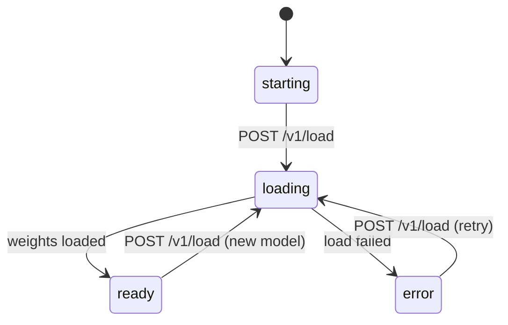
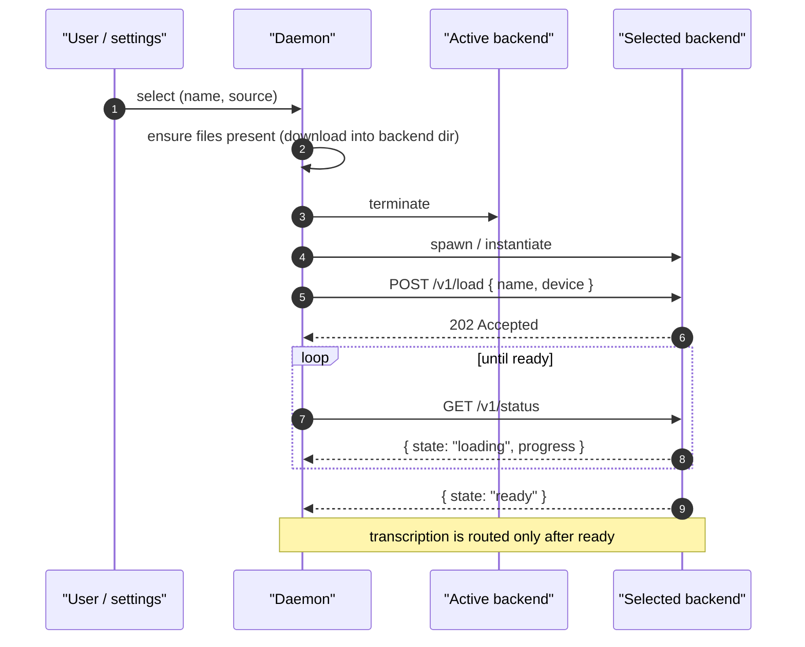

# Backend Protocol

A **backend** is an out-of-tree speech-to-text implementation that the
daemon loads at runtime instead of compiling in. This document defines the
daemon↔backend contract that every backend implements, regardless of how it
is packaged.

The contract is HTTP-shaped and identical for all backends. Only the
*transport* differs: a backend ships either as a WASM component the daemon
invokes in-process, or as a native subprocess the daemon spawns and talks to
over a Unix socket. Authors pick the transport; the routes, payloads, and
lifecycle below do not change.

This document is the companion to:

- [config.md](./config.md) — the `backend.toml` every
  backend ships, and the fields the daemon reads to discover it.
- [wasm.md](./wasm.md) — WASM component backends (cloud /
  API, lightweight CPU).
- [subprocess.md](./subprocess.md) — native subprocess
  backends (local models, GPU).
- [transport.md](../transport.md) — the external client↔daemon wire shape,
  which the backend contract mirrors.

## Model identity

A model is identified by the `(name, source)` pair — the same
pair external clients use on
[`/active_model`](../endpoints/v1/active_model.md):

| Field      | Type   | Notes                                                                       |
|------------|--------|-----------------------------------------------------------------------------|
| `name`     | string | Wire model name, e.g. `whisper-tiny`, `voxtral-mini`, `nova-3`.             |
| `source`   | string | The **backend repository** that provides the model — a canonical repo id declared in the backend's configuration. |

`source` names *which backend* a model comes from. Two backends may both
implement `whisper-tiny`; they coexist and are
disambiguated by `source`. The daemon derives a model's `source` from the
`[backend].source` field of the configuration that declares it — see
[config.md](./config.md).

> `source` supersedes the older `builtin | custom | online` discriminator.
> [active_model.md](../endpoints/v1/active_model.md) and
> [models.md](../endpoints/v1/models.md) are reconciled with this definition.

> `[backend].id` is a separate identifier that names a backend's install
> directory. It is not part of model identity.

## Transports

| Concern             | WASM backend                            | Subprocess backend                       |
|---------------------|-----------------------------------------|------------------------------------------|
| Use for             | Cloud / API models, light CPU work      | Local models, GPU inference              |
| Delivery            | In-process component invocation         | HTTP/SSE over a pathname Unix socket     |
| Contract exposure   | Exports `wasi:http/incoming-handler`    | Serves the `/v1` routes as an HTTP server |
| Network egress      | `wasi:http/outgoing-handler`, allowlisted | None — the process is network-isolated  |
| Sandbox             | wasmtime capability model               | systemd hardening + seccomp              |
| Specification       | [wasm.md](./wasm.md)            | [subprocess.md](./subprocess.md) |

Both deliver the same `/v1` request/response payloads. A WASM backend
receives an HTTP `Request` by direct in-process invocation; a subprocess
backend receives it over its socket. Nothing else about the contract
changes.

## The `/v1` contract

Every backend exposes these routes under the `/v1` prefix. Payloads follow
the envelope convention from [transport.md](../transport.md): responses carry
a top-level `status` field of `"success"` or `"error"`.

| Method | Route            | Purpose                                            |
|--------|------------------|----------------------------------------------------|
| POST   | `/v1/load`       | Load a model variant; drives readiness to `ready`. |
| GET    | `/v1/status`     | Readiness state and load progress.                 |
| GET    | `/v1/ping`       | Liveness.                                          |
| POST   | `/v1/transcribe` | Transcribe audio; one-shot or streaming.           |
| POST   | `/v1/cancel`     | Cancel an in-flight transcription.                 |

### Request headers

On every `/v1` request the daemon injects context as request headers; a
backend reads what it needs and ignores the rest. The daemon owns these
headers — external clients cannot set them.

| Header                | Carries                                                  |
|-----------------------|----------------------------------------------------------|
| `x-stt-model`         | The active model name, e.g. `whisper-1`.                 |
| `x-stt-secret-<name>` | One declared secret, e.g. `x-stt-secret-OPENAI_API_KEY`. |
| `x-stt-option-<name>` | One declared option, e.g. `x-stt-option-base_url`.       |

- `x-stt-model` names the model to transcribe with. The daemon also calls
  [`POST /v1/load`](#post-v1load) with the model before routing, but a
  stateless backend (re-instantiated per request — see [wasm.md](./wasm.md))
  reads `x-stt-model` on each request instead of remembering the load; a
  stateful backend may rely on `load` and ignore the header.
- Secrets and options come from the backend's [configuration](./config.md),
  with values set by the user in the settings UI. The header for a secret or
  option the user has not set is omitted.
- `x-stt-option-base_url` is the one option header the daemon normalizes. It
  carries a canonical `scheme://host[:port][/path]`: lowercase scheme, no
  userinfo, no trailing slash, no query or fragment, and a port only when the
  user set one. A backend can split it at the first `/` after the scheme and
  needs no further parsing. Every other option is passed through exactly as the
  user set it. See [config.md — `base_url` and egress](./config.md#base_url-and-egress).
- **Secret values are sensitive.** The daemon stores them encrypted and
  redacts the `x-stt-secret-*` headers from logs. A backend uses a secret only
  to authenticate its own outbound calls — it must never echo one in a
  response or forward the injected header upstream. An OpenAI backend reads
  `x-stt-secret-OPENAI_API_KEY` and sets its own `Authorization: Bearer`
  header on the request to `api.openai.com`.
- Option values are not sensitive and are stored as plaintext.

### `POST /v1/load`

Load one model variant. The daemon has already provisioned the model's files
into the backend's directory (see [Lifecycle](#lifecycle)); the backend
resolves them from the `dest` paths in its own configuration. The call returns
`202` immediately and the load proceeds asynchronously — progress is read
from [`GET /v1/status`](#get-v1status).

A backend serves exactly one model at a time. Switching models is a fresh
`load` after the daemon has torn the backend down and spawned it again.

**Every backend must implement `/v1/load`.** A backend with nothing to load —
e.g. a cloud backend that holds no local weights — treats it as a no-op: it
acknowledges with `202` and reports `ready` from `GET /v1/status` immediately.
The daemon always calls `load` before routing transcription, so the route
must exist even when it does no work.

**Request:**

```http
POST /v1/load HTTP/1.1
Host: backend.local
Content-Type: application/json

{
  "name":     "whisper-tiny",
  "device":   "cuda"
}
```

| Field      | Type   | Required | Notes                                                          |
|------------|--------|----------|----------------------------------------------------------------|
| `name`     | string | yes      | A model `name` the backend declares in its configuration.           |
| `device`   | string | no       | The resolved accelerator for this load: `cpu`, `cuda`, `rocm`, `metal`, or `vulkan`. This is the accelerator the installed asset actually targets, not the user's `cpu`/`gpu` preference — the daemon resolves that preference against the asset it selected, so a build carrying more than one runtime is told which one to use. The same resolution is what external clients see as `resolved_accel` on [`GET`/`POST /active_device`](../endpoints/v1/active_device.md). **Absent** when the daemon has no record of which accelerator the installed build targets — an install performed from a local directory, for instance — in which case the backend selects for itself. The backend may still fall back; the actual device is reported by `GET /v1/status`. |
| `provider` | string | no       | Present only when the model declares [`provider`](./config.md#models) in its configuration, echoed back verbatim. Carries no meaning to the daemon. |

> **Compatibility.** `provider` was part of model identity before it became
> `(name, source)`. Backends released against the earlier contract reject a
> load whose `provider` does not match their own fixed value, so the daemon
> still forwards the key for any model whose manifest declares it. A new
> backend should ignore it: identity is `name`, and the daemon spawns one
> backend per model.

**Response (202):**

```http
HTTP/1.1 202 Accepted
Content-Type: application/json

{ "status": "success", "message": "Loading started" }
```

**Errors:**

| HTTP | `message`            | Meaning                                                       |
|------|----------------------|---------------------------------------------------------------|
| 400  | `invalid_model`      | `name` is not implemented by this backend.                    |
| 409  | `already_loading`    | A load is already in progress.                                |
| 503  | `device_unavailable` | The requested device cannot be initialized.                   |

### `GET /v1/status`

Report readiness. `state` is the backend's readiness; `status` is the
envelope outcome — they are distinct: `status` is `"success"` whenever the
status report itself is valid, even while `state` is `"loading"` or
`"error"`.

**Request:**

```http
GET /v1/status HTTP/1.1
Host: backend.local
```

**Response (200):**

```jsonc
{
  "status":   "success",   // envelope outcome: "success" | "error"
  "state":    "loading",   // readiness: "starting" | "loading" | "ready" | "error"
  "progress": 0.42,        // present only while state == "loading"; 0.0–1.0
  "model": {               // present once a load has been requested
    "name": "whisper-tiny"
  },
  "device":   "cuda",      // actual device in use: "cpu" | "cuda" | "rocm" | "metal" | "vulkan"
  "reason":   null         // machine-readable cause; set when state == "error"
}
```

| Field      | Type    | Notes                                                                       |
|------------|---------|-----------------------------------------------------------------------------|
| `state`    | string  | `starting` (spawned, no load yet), `loading`, `ready`, or `error`.          |
| `progress` | number? | Load progress `0.0`–`1.0`; present only while `state` is `loading`.         |
| `model`    | object? | The model being loaded or loaded; absent in `starting`.                     |
| `device`   | string? | Device actually in use, one of `cpu`, `cuda`, `rocm`, `metal`, `vulkan`; present once `ready`. |
| `reason`   | string? | Machine-readable failure cause; present only when `state` is `error`.       |

`state` transitions:



The daemon routes transcription to a backend only while `state` is `ready`.

### `GET /v1/ping`

Liveness. A successful response means the backend is running and serving the
contract; it says nothing about whether a model is loaded — use
`GET /v1/status` for that.

**Response (200):**

```http
HTTP/1.1 200 OK
Content-Type: application/json

{ "status": "success", "message": "pong" }
```

### `POST /v1/transcribe`

Transcribe audio the daemon has already captured. Backends never touch a
microphone; the daemon owns capture and always passes samples in
`audio_data`. The route returns a one-shot JSON result, or — when
`options.stream_realtime` is `true` — a Server-Sent Events stream of
`preview` frames followed by a final `done`, mirroring
[transcribe.md](../endpoints/v1/transcribe.md).

**Request:**

```jsonc
{
  "audio_data":  [0.012, -0.034, …],  // f32 PCM samples, required
  "sample_rate": 16000,               // Hz
  "language":    "en",                // optional; must be in supported_languages
  "options": {
    // Emit incremental `event: preview` frames before the final
    // `event: done`. Default: false.
    "stream_realtime": true
  }
}
```

| Field         | Type    | Required | Notes                                                  |
|---------------|---------|----------|--------------------------------------------------------|
| `audio_data`  | array   | yes      | f32 PCM samples.                                        |
| `sample_rate` | number  | no       | Default `16000`.                                        |
| `language`    | string  | no       | BCP-47 transcription language tag (e.g. `en`, `es-MX`, `es-419`) **or** the reserved `auto` (auto-detect). Permitted only for multilingual models; a non-`auto` tag must be one of the model's `supported_languages`. When omitted, the model's `primary_language` is used. |
| `options`     | object  | no       | Per-request options; currently `stream_realtime`.       |

The reserved value `language: "auto"` requests auto-detection: the backend maps
it to its native mechanism (e.g. Deepgram `multi`, Whisper detect-from-audio)
and falls back to the model's `primary_language` if it cannot. Backends MUST
accept `auto` without error; it is never rejected with `unsupported_language`.

**Response — one-shot (200):**

```http
HTTP/1.1 200 OK
Content-Type: application/json

{ "status": "success", "transcription": "hello world" }
```

**Response — streaming (200):** a `text/event-stream` carrying zero or more
`preview` frames then one `done`:

| `event:`  | `data:` payload                      | When                                              |
|-----------|--------------------------------------|---------------------------------------------------|
| `preview` | `{ "text": "hello wor…" }`           | Incremental result while decoding continues.      |
| `done`    | `{ "transcription": "hello world" }` | Final transcription; the stream closes after it.  |
| `error`   | `{ "message": "..." }`               | Fatal error before `done`; the stream then closes. |

**Errors:**

| HTTP | `message`               | Meaning                                                       |
|------|-------------------------|---------------------------------------------------------------|
| 400  | `invalid_audio`         | `audio_data` is missing or empty.                             |
| 400  | `unsupported_language`  | `language` is not in the model's `supported_languages`.       |
| 409  | `not_ready`             | No model is loaded; check `GET /v1/status`.                   |
| 500  | `inference_failed`      | The backend failed during inference.                          |

Once a streaming response has started, late errors arrive as an in-stream
`event: error` frame followed by the connection closing.

### `POST /v1/cancel`

Cancel the in-flight transcription, if any. The corresponding
`/v1/transcribe` response terminates (a streaming one with an `event: error`
or by closing). Returns `409 nothing_in_progress` when no transcription is
running.

**Response (200):**

```http
HTTP/1.1 200 OK
Content-Type: application/json

{ "status": "success", "message": "Cancelled" }
```

## Realtime transcription

Realtime models use a WebSocket endpoint rather than batch `POST /v1/transcribe`.
A model is realtime when `[[models]] realtime = true` is set in its backend
configuration (see [config.md](./config.md#models)). The batch route is for
non-realtime models only.

### Consumer-facing endpoint

```
GET /v1/transcribe/realtime
```

The daemon serves this endpoint. It is **not** part of the backend-facing `/v1`
contract above — the daemon bridges consumer WebSocket frames directly into the
backend's `ws-server.handle` export (see
[wasm.md — Realtime](./wasm.md#realtime-websocket)). The JSON control protocol
below is interpreted by the backend guest, not by the daemon.

**Auth:** same scope and bearer token as `POST /v1/transcribe` (`client` scope
required; `settings` tokens also satisfy it). The token must appear in the HTTP
upgrade request's `Authorization: Bearer <token>` header.

### Frame protocol

The daemon is a pure relay: it shuttles WebSocket frames between the consumer
and the backend guest without inspecting or rewriting the payload.

| Direction | Frame type | Payload |
|-----------|-----------|---------|
| Client → server | text | `{"type":"start","sample_rate":16000,"language":"en"}` — first frame; `language` is optional. |
| Client → server | binary | Raw little-endian 16-bit PCM mono audio at the declared `sample_rate`. |
| Client → server | text | `{"type":"stop"}` — optional explicit end; a WebSocket Close also ends the session. |
| Server → client | text | `{"type":"preview","text":"…"}` — incremental partial transcript. |
| Server → client | text | `{"type":"done","transcription":"…"}` — final transcript; the backend then closes. |
| Server → client | text | `{"type":"error","message":"…"}` — fatal error; the backend then closes. |

### Session lifecycle

- The daemon holds the active model for the session's entire duration; a
  model switch initiated while a session is open waits until the session ends.
- A consumer disconnect ends the session promptly — the daemon detects the
  close on the next relay write.
- An idle session (no consumer frame arriving for 60 seconds) is aborted by
  the daemon, releasing the model hold.

## Lifecycle

The daemon discovers every installed backend by reading configurations
(cheap, no process started), then initializes only the **selected** one.
Discovery is covered in [config.md](./config.md).

When a model is selected the daemon:

1. Ensures the model's files are present, downloading them into the
   backend's directory per the configuration. Local backends are
   network-isolated, so the daemon — not the backend — performs every
   download.
2. **Terminates the currently active backend before starting the new one.**
   A switch never runs two model-loaded backends at once, so GPU memory is
   never doubled.
3. Spawns (subprocess) or instantiates (WASM) the selected backend.
4. Calls `POST /v1/load` and polls `GET /v1/status` until `state` is
   `ready`.
5. Routes transcription only after `ready`. A `/v1/transcribe` arriving
   before then is gated with `409 not_ready`.



## Security model

Backends are untrusted code. The daemon mediates everything a backend can
reach:

- **Network.** A WASM backend's only egress is the host-implemented
  `wasi:http/outgoing-handler`, validated against the `allowed_hosts` in its
  configuration; raw sockets are not granted. A subprocess backend runs with no
  network at all. See [wasm.md](./wasm.md) and
  [subprocess.md](./subprocess.md). One deliberate exception: the `host:port`
  the *user* sets in a backend's `base_url` option is added to that backend's
  egress with the SSRF guard relaxed for it, so a user can point a cloud backend
  at a local or private gateway. It covers that one authority, never the
  link-local/metadata range, and the value must be the user's — a `default` a
  manifest declares for `base_url` never takes effect — so a backend cannot
  self-authorize it; see
  [config.md — `base_url` and egress](./config.md#base_url-and-egress).
- **Filesystem.** A subprocess backend is confined to its own directory; a
  WASM backend has no ambient filesystem access.
- **Secrets and options.** A backend declares the API keys (secrets) and
  configuration (options) it needs; the user sets them in the settings UI.
  The daemon stores secrets encrypted in the keyring and options as plaintext,
  and injects both as request headers on every `/v1` request (see
  [request headers](#request-headers)). Backends never read them from
  disk. Over the external client API, secret values are **write-only**: a
  client sets or clears a secret but the daemon never returns a stored value
  (see the [`secrets` scope](../scopes/secrets.md)); option values, being
  non-sensitive, are returned.

The daemon's own hardening and the threat model are described in
[SECURITY.md](../../SECURITY.md).
