# Daemon Protocol

One picture of the daemon: where a request enters, what carries it, and which
route group answers it. Everything here is specified in detail elsewhere —
[transport.md](./transport.md) for the wire shape, [auth.md](./auth.md) for
the handshake and scopes, [endpoints/](./endpoints/) for each route, and
[backend/contract.md](./backend/contract.md) for the far side of the pipeline.
This page exists so that a reader can see how those fit together before
reading any of them.

The HTTP API is the whole client surface. The D-Bus name beside it answers one
question — is the daemon up — and is deliberately not a second way in.

```mermaid
graph TD
    subgraph Daemon ["super-tts Daemon"]
        D_Auth[Auth Service]
        D_API[HTTP API /v1]
        D_SSE[Event Stream]
        D_DBus[D-Bus Interface]
        D_Core[Core Logic / TTS Pipeline]
    end

    %% Authentication Flow
    D_Auth -- "Consent Popup / Token" --> D_API

    %% Command Flow
    D_API -- "DaemonRequest" --> D_Core
    D_Core -- "DaemonResponse" --> D_API

    %% Event Flow
    D_Core -- "Events (Playback, Synthesis, Progress, Audio Levels)" --> D_SSE

    %% HTTP Route Groups
    D_API --> R_Auth["/auth"]
    D_API --> R_Speak["/speak"]
    D_API --> R_Pipeline["/pipeline"]
    D_API --> R_Backend["/backend"]
    D_API --> R_Registry["/registry"]
    D_API --> R_Settings["/settings"]
    D_API --> R_Voice["/voice"]
    D_API --> R_Top["top level"]

    %% Auth Endpoints
    R_Auth -.-> E1["POST /request"]
    R_Auth -.-> E2["GET /status"]

    %% Speak Endpoints
    R_Speak -.-> E3["POST /"]
    R_Speak -.-> E4["POST /stop"]
    R_Speak -.-> E5["GET /stream (WebSocket)"]

    %% Pipeline Endpoints — stage 1 is synthesis, and the only stage
    R_Pipeline -.-> E6["GET /"]
    R_Pipeline -.-> E7["GET/POST/DELETE /{stage}"]
    R_Pipeline -.-> E8["GET /{stage}/backend/list"]
    R_Pipeline -.-> E9["GET/POST/DELETE /{stage}/model"]
    R_Pipeline -.-> E10["GET /{stage}/model/list"]
    R_Pipeline -.-> E11["POST /{stage}/model/cancel<br/>POST /{stage}/model/reload"]
    R_Pipeline -.-> E12["GET/POST /{stage}/model/{model}/device<br/>GET /{stage}/model/{model}/device/list"]
    R_Pipeline -.-> E13["GET/POST/DELETE /{stage}/model/{model}/language<br/>GET /{stage}/model/{model}/language/list"]

    %% Backend Endpoints
    R_Backend -.-> E14["GET /list"]
    R_Backend -.-> E15["DELETE /{backend_id}"]
    R_Backend -.-> E16["GET/POST/DELETE /{backend_id}/option/{name}"]
    R_Backend -.-> E17["GET/POST/DELETE /{backend_id}/secret/{name}"]

    %% Registry Endpoints
    R_Registry -.-> E18["GET /backend/list"]
    R_Registry -.-> E19["POST /backend/install"]
    R_Registry -.-> E20["POST /backend/refresh"]
    R_Registry -.-> E21["POST /backend/update"]

    %% Settings Endpoints
    R_Settings -.-> E22["GET/POST /volume"]
    R_Settings -.-> E23["GET/POST /audio_theme<br/>GET /audio_theme/list<br/>POST /audio_theme/test"]
    R_Settings -.-> E24["GET/POST/DELETE /language<br/>GET /language/list"]
    R_Settings -.-> E25["GET/POST /notification_method"]
    R_Settings -.-> E26["GET/POST /allow_online_models"]
    R_Settings -.-> E27["GET/POST /custom_models_dir"]
    R_Settings -.-> E28["GET/POST /update_check_enabled<br/>GET/POST /update_beta_optin"]

    %% Voice Endpoints — the cloned-voice library
    R_Voice -.-> E29["GET /list"]
    R_Voice -.-> E30["POST /"]
    R_Voice -.-> E31["GET/PATCH/DELETE /{id}"]
    R_Voice -.-> E32["GET /{id}/audio"]

    %% Top-level Endpoints
    R_Top -.-> E33["GET /ping"]
    R_Top -.-> E34["GET /status"]
    R_Top -.-> E35["GET /gpu_info"]
    R_Top -.-> E36["GET /update<br/>POST /update/check"]
    R_Top -.-> E37["GET /events?topics=..."]
    E37 --> D_SSE

    %% Backend transport
    D_Core -- "POST /v1/load, /v1/synthesize, /v1/cancel" --> B_WASM["WASM component<br/>(in-process)"]
    D_Core -- "same routes over a Unix socket" --> B_Proc["Subprocess backend"]

    %% D-Bus Interface
    D_DBus --> DB_Int["com.github.jorge_menjivar.SuperTTS1"]
    DB_Int --> DB_Obj["/com/github/jorge_menjivar/SuperTTS"]
    DB_Obj -.-> DB_M1["ping()"]
    DB_Obj -.-> DB_M2["get_status()"]
```

## Reading the graph

**Every path is versioned.** The route groups above are drawn without the
`/v1` prefix every request carries: `/speak` is `POST /v1/speak`. The prefix
is part of the client protocol and is not the same number as a backend's
[contract generation](./backend/config.md#contract-generations).

**`/pipeline` has exactly one stage.** Stage 1 is synthesis. The path is
parameterized because the shape is worth keeping — a stage owns its backend,
its model, and that model's device and language — but `GET /v1/pipeline/2`
answers `404 unknown_stage`, naming the stages that do exist.

**`/settings` is not the same as the `settings` scope.** Everything the user
can set lives under `/v1/settings/`, and nothing else does. `/backend`,
`/pipeline`, `/registry`, `/gpu_info` and `/update` are all reached with a
`settings` token but are not settings — they select and manage what runs,
rather than storing a preference. See [scopes/settings.md](./scopes/settings.md).

**The event stream is one connection, not one per topic.** A client asks for
the topics it wants on a single `GET /v1/events` subscription, and a topic
outside the token's scopes fails the whole stream with `403 scope_denied`
before it opens — rather than being quietly dropped from a stream that then
looks healthy and never delivers. See
[endpoints/v1/events.md](./endpoints/v1/events.md).

## Why D-Bus carries so little

The daemon owns a session-bus name and serves two methods on it: `ping()` and
a coarse `get_status()` that reports only that something is serving the name
and which version it is.

It does not publish signals. The daemon has playback-lifecycle and audio-level
events, and they are exactly what a bus signal would be good for — but a
session-bus signal is readable by every process on the bus, while the same
information on `GET /v1/events` costs a
[`playback_events`](./scopes/playback_events.md) or
[`audio_visualization`](./scopes/audio_visualization.md) grant the user has to
approve. Publishing both would make that consent prompt a formality: anything
denied there could listen on the bus instead.

What is left on the bus is what carries nothing the user would want gated —
the well-known name, so "is the daemon running?" is answerable without opening
the socket, and a liveness ping. Whether the daemon is *speaking*, and which
model it loaded, stay behind the `status` scope on
[`GET /v1/status`](./endpoints/v1/status.md).
