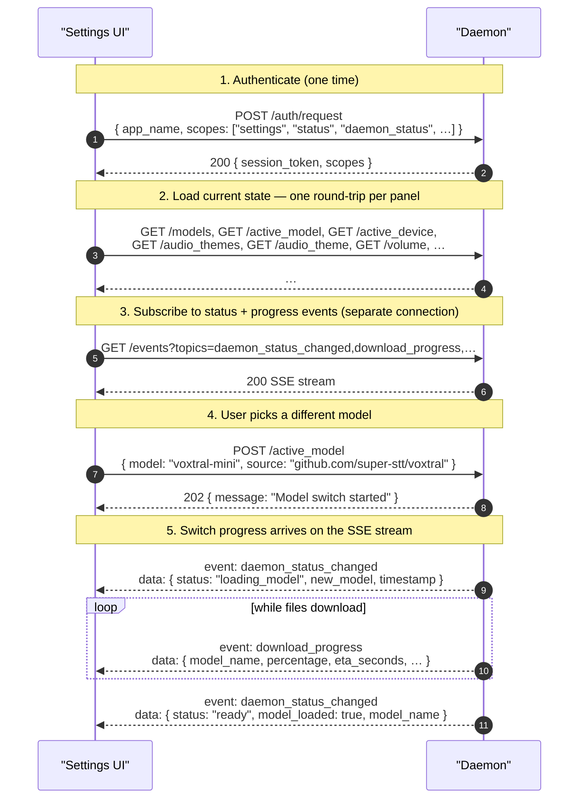

# settings scope

> Scope: **settings** (full read/write access to daemon configuration and the
> backend registry).

The `settings` scope is the configuration surface: a `settings` token can read
every daemon configuration value, change any of them, persist the change to disk,
and manage installed backends through the registry. It covers a backend's
non-sensitive **options**; a backend's **secrets** (API keys) are managed
separately under the [`secrets`](./secrets.md) scope and are never readable.

It grants **only** that surface — scopes no longer imply one another. A Settings
UI that also drives test recordings, shows daemon status, or renders a visualizer
requests those scopes *alongside* `settings` in the same handshake, e.g.
`["settings", "status", "transcribe", "recording_events", "audio_visualization", "daemon_status"]`.
See [auth.md](../auth.md) for how scopes compose, and the individual scope docs
([status](./status.md), [transcribe](./transcribe.md),
[recording_events](./recording_events.md),
[audio_visualization](./audio_visualization.md),
[daemon_status](./daemon_status.md)) for what each adds.

Transport and framing are described in [transport.md](../transport.md).

## What gets mirrored on `/events`

Settings mutations have **two** observable wire effects: the HTTP response on the
request that made them, and (for model/device transitions) follow-up SSE events
on any `GET /events` subscription that holds the [`daemon_status`](./daemon_status.md)
scope and asked for `daemon_status_changed` or `download_progress`.

| Mutation                                                                                                                          | Mirrored as an SSE event?                                                                            |
|-----------------------------------------------------------------------------------------------------------------------------------|------------------------------------------------------------------------------------------------------|
| `/active_model`, `/active_backend`, `/active_device`, `/allow_online_models` (when it triggers a fallback)                       | Yes — `daemon_status_changed` (and `download_progress` while files are being pulled)                 |
| `/update_check_enabled`, `/update_beta_optin`                                                                                    | Yes — `daemon_status_changed` (`settings_changed` variant)                                            |
| `/audio_theme`, `/volume`, `/write_method`, `/notification_method`, `/recording_stop_mode`, `/preview_typing`, `/allow_online_models` (no fallback), `/custom_models_dir` | No. Clients that want to see *another* app change one of these must re-`GET` the relevant endpoint.  |

## Endpoint reference

| Endpoint                                                    | Methods    | Notes                                                                                                |
|-------------------------------------------------------------|------------|------------------------------------------------------------------------------------------------------|
| [`/active_model`](../endpoints/v1/active_model.md)          | POST, GET  | Switch the active STT model and read its current state + any in-flight switch                        |
| [`/active_model/cancel`](../endpoints/v1/active_model/cancel.md) | POST  | Abort an in-flight model switch                                                                       |
| [`/backends/{source}/models/{model}/language`](../endpoints/v1/backends/model-language.md) | GET, POST, DELETE | Per-model language override + resolved effective language |
| [`/models`](../endpoints/v1/models.md)                      | GET        | List built-in + custom models                                                                         |
| [`/active_device`](../endpoints/v1/active_device.md)        | POST, GET  | Switch CPU vs CUDA; read current device + GPU memory                                                  |
| [`/language`](../endpoints/v1/language.md)                  | GET, POST, DELETE | Global Primary Language (BCP-47 tag / `auto` / unset)                          |
| [`/audio_theme`](../endpoints/v1/audio_theme.md)            | POST, GET  | Set / read the audio cue theme                                                                        |
| [`/audio_theme/test`](../endpoints/v1/audio_theme/test.md)  | POST       | Audition the current theme's start + stop cues                                                        |
| [`/audio_themes`](../endpoints/v1/audio_themes.md)          | GET        | List available themes                                                                                  |
| [`/volume`](../endpoints/v1/volume.md)                      | POST, GET  | Set / read audio cue volume (0–100)                                                                   |
| [`/recording_stop_mode`](../endpoints/v1/recording_stop_mode.md) | POST, GET | Default stop behavior for `/transcribe` (silence_only / silence_and_manual / manual_only)                  |
| [`/preview_typing`](../endpoints/v1/preview_typing.md)      | POST, GET  | Toggle live typing of preview text while recording                                                    |
| [`/write_method`](../endpoints/v1/write_method.md)          | POST, GET  | Keyboard simulation method (auto / xdg_desktop_portal / ydotool / wayland_protocol)                   |
| [`/write_method/test`](../endpoints/v1/write_method/test.md) | POST      | Type a test string with the configured method; reports the backend it resolved to                     |
| [`/notification_method`](../endpoints/v1/notification_method.md) | POST, GET  | How recording failures are surfaced (auto / dbus / typed / off)                                       |
| [`/allow_online_models`](../endpoints/v1/allow_online_models.md) | POST, GET | Privacy gate for online providers (OpenAI / Mistral / Deepgram)                                       |
| [`/custom_models_dir`](../endpoints/v1/custom_models_dir.md) | POST, GET | Where to scan for user-supplied models                                                                |
| [`/backends`](../endpoints/v1/backends.md)                  | GET, DELETE | List installed backends; uninstall a backend                                                  |
| [`/backends/{source}/options`](../endpoints/v1/backends/options.md) | GET, POST, DELETE | List / read / set / reset a backend's non-sensitive options                          |
| [`/active_backend`](../endpoints/v1/active_backend.md)      | GET, POST, DELETE | Read / set / clear the active backend                                                          |
| [`/gpu_info`](../endpoints/v1/gpu_info.md)                  | GET        | GPU / VRAM information                                                                                 |
| [`/registry/backends`](../endpoints/v1/registry/backends.md) | GET      | List backends available in the registry                                                               |
| [`/registry/backends/refresh`](../endpoints/v1/registry/refresh.md) | POST | Refresh the registry index                                                                            |
| [`/registry/backends/install`](../endpoints/v1/registry/install.md) | POST | Install a backend from the registry                                                                   |
| [`/registry/backends/update`](../endpoints/v1/registry/update.md) | POST | Update an installed registry backend                                                                  |
| [`/update`](../endpoints/v1/update.md) | GET | Self-update availability (daemon version vs latest release) |
| [`/update/check`](../endpoints/v1/update/check.md) | POST | Force an immediate self-update check |
| [`/update_check_enabled`](../endpoints/v1/update_check_enabled.md) | POST, GET | Toggle / read the daemon's periodic self-update check |
| [`/update_beta_optin`](../endpoints/v1/update_beta_optin.md) | POST, GET | Whether prerelease versions are considered for updates (auto / enabled / disabled) |

## A typical settings session

A settings UI usually opens two HTTP connections in parallel: one-shot
connections for each read or write, plus a long-lived SSE connection for
`/events`. The SSE channel carries running model-switch progress so the UI's
progress bar updates without polling — which is why the handshake also requests
[`daemon_status`](./daemon_status.md).

Settings mutations that aren't mirrored on `/events` (the non-model row of the
table at the top) won't trigger SSE events; a settings UI that wants to detect
another app changing those needs to re-`GET` the relevant endpoint.
