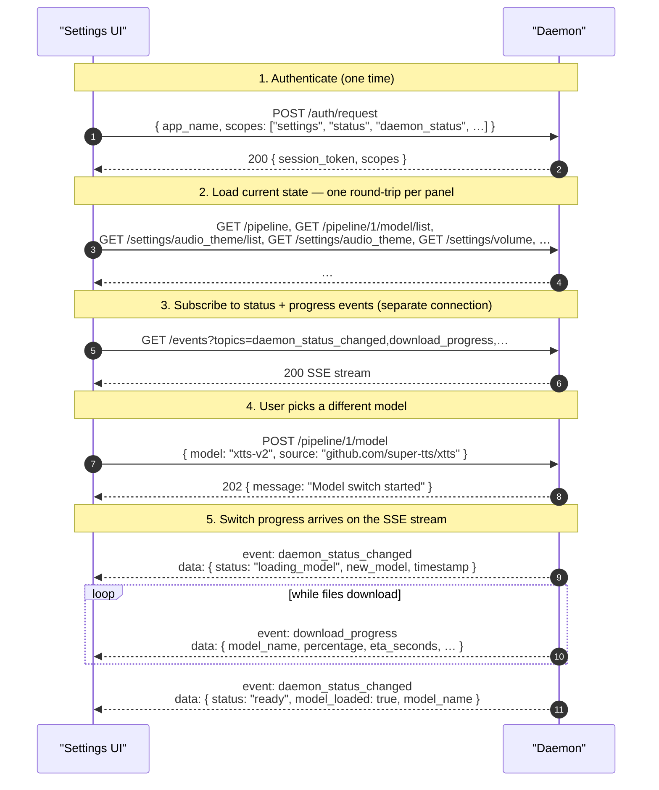

# settings scope

> Scope: **settings** (full read/write access to daemon configuration and the
> backend registry).

The `settings` scope is the configuration surface: a `settings` token can read
every daemon configuration value, change any of them, persist the change to disk,
and manage installed backends through the registry. It covers a backend's
non-sensitive **options**; a backend's **secrets** (API keys) are managed
separately under the [`secrets`](./secrets.md) scope and are never readable.

It grants **only** that surface — scopes no longer imply one another. A Settings
UI that also drives test speech, shows daemon status, or renders a visualizer
requests those scopes *alongside* `settings` in the same handshake, e.g.
`["settings", "status", "speak", "playback_events", "audio_visualization", "daemon_status"]`.
See [auth.md](../auth.md) for how scopes compose, and the individual scope docs
([status](./status.md), [speak](./speak.md),
[playback_events](./playback_events.md),
[audio_visualization](./audio_visualization.md),
[daemon_status](./daemon_status.md)) for what each adds.

Transport and framing are described in [transport.md](../transport.md).

## What gets mirrored on `/events`

Settings mutations have **two** observable wire effects: the HTTP response on the
request that made them, and (for model/device transitions) follow-up SSE events
on any `GET /events` subscription that holds the [`daemon_status`](./daemon_status.md)
scope and asked for `daemon_status_changed` or `download_progress`.

| Mutation                                                                                                                          | Mirrored as an SSE event?                                                                            |
|-----------------------------------------------------------------------------------------------------------------------------------|------------------------------------------------------------------------------------------------------|
| `/pipeline/{stage}/model`, `/pipeline/{stage}/model/{model}/device` (when it reloads the model), `/settings/allow_online_models` (when it triggers a fallback) | Yes — `daemon_status_changed` (and `download_progress` while files are being pulled)                  |
| `/pipeline/{stage}` (backend selection)                                                                                          | Yes — `daemon_status_changed` (`active_backend_changed` variant)                                      |
| `/settings/language`, `/settings/update_check_enabled`, `/settings/update_beta_optin`                                            | Yes — `daemon_status_changed` (`settings_changed` variant, carrying which setting changed)             |
| `/settings/audio_theme`, `/settings/volume`, `/settings/notification_method`, `/settings/allow_online_models` (no fallback), `/settings/custom_models_dir` | No. Clients that want to see *another* app change one of these must re-`GET` the relevant endpoint.  |

## Endpoint reference

| Endpoint                                                    | Methods    | Notes                                                                                                |
|-------------------------------------------------------------|------------|------------------------------------------------------------------------------------------------------|
| [`/pipeline`](../endpoints/v1/pipeline.md)                  | GET        | The stages an utterance passes through. Stage 1 is synthesis, and the only stage                      |
| [`/pipeline/{stage}`](../endpoints/v1/pipeline/stage.md)    | GET, POST, DELETE | Read / select / clear the backend filling one stage                                            |
| [`/pipeline/{stage}/backend/list`](../endpoints/v1/pipeline/backend-list.md) | GET | The backends that can fill this stage                                              |
| [`/pipeline/{stage}/device/list`](../endpoints/v1/pipeline/device.md#get-pipelinestagedevicelist) | GET | The devices this install can run the stage's backend on             |
| [`/pipeline/{stage}/model`](../endpoints/v1/pipeline/model.md) | GET, POST, DELETE | Read the stage's model and any in-flight switch; run one; stop it               |
| [`/pipeline/{stage}/model/list`](../endpoints/v1/pipeline/model-list.md) | GET | The models this stage can run — its backend's                                            |
| [`/pipeline/{stage}/model/cancel`](../endpoints/v1/pipeline/model.md#post-pipelinestagemodelcancel) | POST | Abort an in-flight model load for one stage                       |
| [`/pipeline/{stage}/model/reload`](../endpoints/v1/pipeline/model.md#post-pipelinestagemodelreload) | POST | Re-instantiate a stage in place, applying changed secrets/options |
| [`/pipeline/{stage}/model/{model}/device`](../endpoints/v1/pipeline/device.md) | GET, POST | Read / set the device one of a stage's models runs on (cpu / gpu)          |
| [`/pipeline/{stage}/model/{model}/device/list`](../endpoints/v1/pipeline/device.md#get-pipelinestagemodelmodeldevicelist) | GET | The devices this install can run that model on |
| [`/pipeline/{stage}/model/{model}/language`](../endpoints/v1/pipeline/language.md) | GET, POST, DELETE | Per-model language override + resolved effective language      |
| [`/pipeline/{stage}/model/{model}/language/list`](../endpoints/v1/pipeline/language.md#get-pipelinestagemodelmodellanguagelist) | GET | The language tags that model accepts |
| [`/settings/language`](../endpoints/v1/settings/language.md) | GET, POST, DELETE | Global Primary Language (BCP-47 tag / `auto` / unset)                                  |
| [`/settings/language/list`](../endpoints/v1/settings/language/list.md) | GET | The tags `POST /settings/language` accepts, plus `auto`                                     |
| [`/settings/audio_theme`](../endpoints/v1/settings/audio_theme.md) | POST, GET  | Set / read the audio cue theme                                                                 |
| [`/settings/audio_theme/list`](../endpoints/v1/settings/audio_theme/list.md) | GET | List available themes                                                                 |
| [`/settings/audio_theme/test`](../endpoints/v1/settings/audio_theme/test.md) | POST | Audition the current theme's start + stop cues                                       |
| [`/settings/volume`](../endpoints/v1/settings/volume.md)    | POST, GET  | Set / read audio cue volume (0–100)                                                                   |
| [`/settings/notification_method`](../endpoints/v1/settings/notification_method.md) | POST, GET  | How synthesis failures are surfaced (auto / off)                               |
| [`/settings/allow_online_models`](../endpoints/v1/settings/allow_online_models.md) | POST, GET | Privacy gate for online providers (OpenAI / ElevenLabs)                         |
| [`/settings/custom_models_dir`](../endpoints/v1/settings/custom_models_dir.md) | POST, GET | Where to scan for user-supplied models                                              |
| [`/settings/update_check_enabled`](../endpoints/v1/settings/update_check_enabled.md) | POST, GET | Toggle / read the daemon's periodic self-update check                        |
| [`/settings/update_beta_optin`](../endpoints/v1/settings/update_beta_optin.md) | POST, GET | Whether prerelease versions are considered for updates (auto / enabled / disabled) |
| [`/backend/list`](../endpoints/v1/backends.md#get-backendlist) | GET      | List installed backends                                                                               |
| [`/backend/{backend_id}`](../endpoints/v1/backends.md#delete-backendbackend_id) | DELETE | Uninstall a backend                                                                 |
| [`/backend/{backend_id}/option/list`](../endpoints/v1/backends/options.md) | GET | Every option a backend declares, with its effective value                                     |
| [`/backend/{backend_id}/option/{name}`](../endpoints/v1/backends/options.md) | GET, POST, DELETE | Read / set / reset one non-sensitive option                                 |
| [`/gpu_info`](../endpoints/v1/gpu_info.md)                  | GET        | GPU / VRAM information                                                                                 |
| [`/registry/backend/list`](../endpoints/v1/registry/backends.md) | GET   | List backends available in the registry                                                               |
| [`/registry/backend/refresh`](../endpoints/v1/registry/refresh.md) | POST | Refresh the registry index                                                                            |
| [`/registry/backend/install`](../endpoints/v1/registry/install.md) | POST | Install a backend from the registry                                                                   |
| [`/registry/backend/update`](../endpoints/v1/registry/update.md) | POST | Update an installed registry backend                                                                  |
| [`/update`](../endpoints/v1/update.md) | GET | Self-update availability (daemon version vs latest release) |
| [`/update/check`](../endpoints/v1/update/check.md) | POST | Force an immediate self-update check |

`{backend_id}` is the backend's repository `source`, percent-encoded. `{stage}`
is a pipeline position: `1` is synthesis, and any other position answers
`404 unknown_stage` naming the ones that exist.

Everything a user can *set* is under `/settings/`, and nothing else is.
Sharing the `settings` scope is not the same as being a setting: `/pipeline`,
`/backend`, `/registry`, `/gpu_info` and `/update` need a `settings` token but
select and manage what runs rather than storing a preference, so they sit
outside that namespace.

## A typical settings session

A settings UI usually opens two HTTP connections in parallel: one-shot
connections for each read or write, plus a long-lived SSE connection for
`/events`. The SSE channel carries running model-switch progress so the UI's
progress bar updates without polling — which is why the handshake also requests
[`daemon_status`](./daemon_status.md).

Settings mutations that aren't mirrored on `/events` (the non-model row of the
table at the top) won't trigger SSE events; a settings UI that wants to detect
another app changing those needs to re-`GET` the relevant endpoint.
