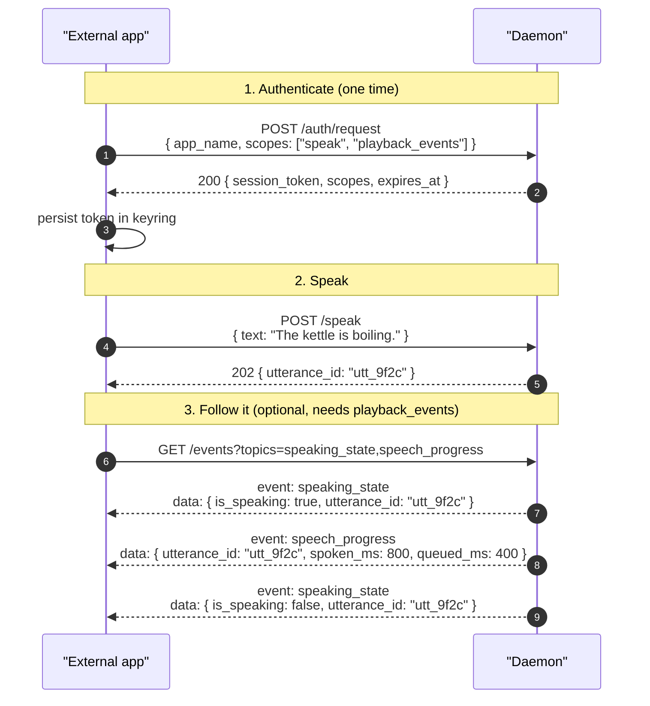

# speak scope

> Scope: **speak** (play synthesized speech through the machine's speakers, and
> stop speech — including speech another app started).

The `speak` scope covers producing audio: submitting text to be spoken, and
stopping whatever is currently playing. It grants nothing else — no
configuration reads or writes (see [`settings`](./settings.md)), and no
visibility into playback state over the event stream (see
[`playback_events`](./playback_events.md)).

What a user gives up by granting this is **control of their speakers**. The part
that surprises people is the interruption: one utterance plays at a time and the
newest wins, so an app with this scope can cut off whatever else is being read
aloud, and can silence it outright with `/speak/stop`. The consent prompt says
so in those words.

Scopes are composable — request the set you need in a single
[`POST /auth/request`](../endpoints/v1/auth/request.md); see [auth.md](../auth.md).
An app that shows the user what it is saying usually wants
[`playback_events`](./playback_events.md) alongside this one.

All traffic is HTTP/1.1 over the Unix domain socket at
`$XDG_RUNTIME_DIR/tts/super-tts-http.sock`. See [transport.md](../transport.md)
for the wire-level details (HTTP framing, SSE mechanics, example client code).

## Endpoint reference

| Endpoint                                                | Methods  | Notes                                            |
|---------------------------------------------------------|----------|--------------------------------------------------|
| [`/speak`](../endpoints/v1/speak.md)                    | POST     | Speak complete text; returns once queued         |
| [`/speak/stop`](../endpoints/v1/speak/stop.md)          | POST     | Stop the current utterance; idempotent           |
| [`/speak/stream`](../endpoints/v1/speak/stream.md)      | GET (WS) | Stream text in as it is generated                |

[`/auth/request`](../endpoints/v1/auth/request.md),
[`/auth/status`](../endpoints/v1/auth/status.md), and
[`/ping`](../endpoints/v1/ping.md) require only a valid token, not the `speak`
scope.

## Which endpoint to use

| You have                                        | Use                                                        |
|-------------------------------------------------|------------------------------------------------------------|
| Complete text, now                              | [`POST /speak`](../endpoints/v1/speak.md)                  |
| Text arriving over time (an LLM reply)          | [`GET /speak/stream`](../endpoints/v1/speak/stream.md)     |
| A stop button or hotkey                         | [`POST /speak/stop`](../endpoints/v1/speak/stop.md)        |

`POST /speak` is not a toggle: issuing it while something is playing interrupts
that utterance and starts yours. There is no "already speaking" error to handle,
which is deliberate — "speak this instead" is the common intent. To implement a
speak/silence toggle, read `busy` on
[`GET /status`](../endpoints/v1/status.md) (the `status` scope) and route to
`/speak/stop` when it is `true`. The `super-tts-cli` `speak` and `stop`
subcommands are the two halves.

## A typical speaking session

The end-to-end shape for a non-Rust client speaking one piece of text. The
handshake at step 1 only runs the *first* time; cached tokens go straight to
step 2.

On any `401 invalid_session` the cached token is dead — re-run step 1 and retry.
