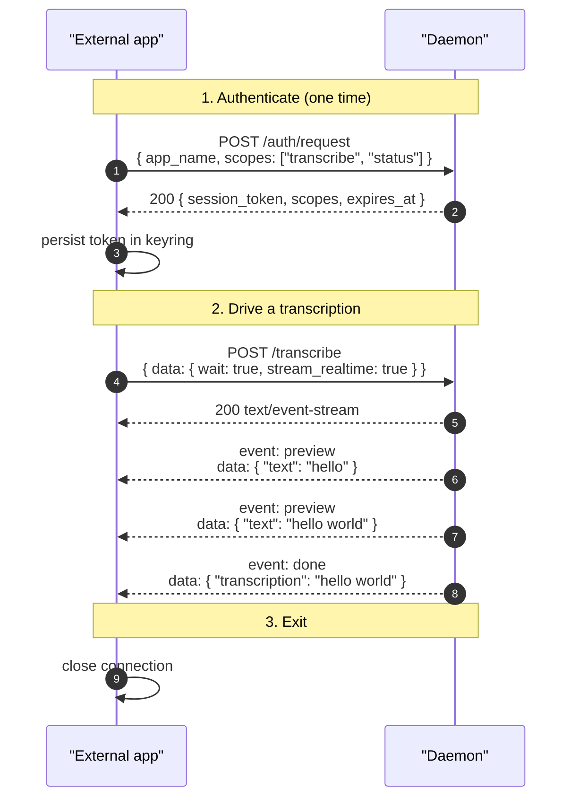

# transcribe scope

> Scope: **transcribe** (drive the microphone through the daemon and read back
> transcription results from your own sessions; no configuration access and no
> visibility into other apps' recordings or transcriptions).

The `transcribe` scope covers starting and stopping recordings and reading the
result of your *own* requests. It grants nothing else: no configuration reads or
writes (see [`settings`](./settings.md)) and no event-stream access to other
apps' recording state, audio, or transcriptions (see
[`recording_events`](./recording_events.md),
[`audio_visualization`](./audio_visualization.md), and
[`global_transcriptions`](./global_transcriptions.md)).

A client that needs to implement a toggle hotkey usually also requests
[`status`](./status.md), so it can read `busy` and route between start
and stop. Scopes are composable — request the set you need in a single
[`POST /auth/request`](../endpoints/v1/auth/request.md); see [auth.md](../auth.md).

All traffic is HTTP/1.1 over the Unix domain socket at
`$XDG_RUNTIME_DIR/stt/super-stt-http.sock`. See [transport.md](../transport.md)
for the wire-level details (HTTP framing, SSE mechanics, example client code).

## Endpoint reference

| Endpoint                                                      | Methods   | Notes                                       |
|--------------------------------------------------------------|-----------|---------------------------------------------|
| [`/transcribe`](../endpoints/v1/transcribe.md)               | POST      | Start a transcription                       |
| [`/transcribe/stop`](../endpoints/v1/transcribe/stop.md)     | POST      | Stop an in-flight daemon-mic capture        |
| `/transcribe/realtime`                                       | GET (WS)  | Realtime WebSocket transcription session    |

[`/auth/request`](../endpoints/v1/auth/request.md),
[`/auth/status`](../endpoints/v1/auth/status.md), and
[`/ping`](../endpoints/v1/ping.md) require only a valid token, not the
`transcribe` scope.

## The four `/transcribe` modes

A single endpoint covers four use cases, dispatched on the body. The full
request body, response shape, and error table are on
[`/transcribe`](../endpoints/v1/transcribe.md); the quick map:

| Use case                                  | `audio_data`    | `stream_realtime` | `wait`         | Response                                                  |
|-------------------------------------------|-----------------|-------------------|----------------|-----------------------------------------------------------|
| Daemon-mic, fire-and-forget               | absent          | (ignored)         | `false`        | `202` + `{ message: "Recording started" }`                |
| Daemon-mic, wait for final                | absent          | `false`           | `true`         | `200 text/event-stream` with a single `event: done`       |
| Daemon-mic, stream preview + final        | absent          | `true`            | `true`         | `200 text/event-stream` with `event: preview` then `event: done` |
| Pre-captured audio (one-shot)             | `[f32]` present | (must be `false`) | (implicit)     | `200` JSON with `{ "transcription": "..." }`              |

`POST /transcribe` never doubles as a stop signal — issuing it while a
daemon-mic capture is already running returns `409 recording_in_progress`. To
implement toggle behavior, consult `busy` on
[`GET /status`](../endpoints/v1/status.md) (the `status` scope) and route to
[`POST /transcribe/stop`](../endpoints/v1/transcribe/stop.md) when a capture is
in progress. The `super-stt` CLI's `record` subcommand does exactly this.

## A typical transcription session

The end-to-end shape for a non-Rust client driving one recording. The handshake
at step 1 only runs the *first* time; cached tokens go straight to step 2.

On any `401 invalid_session` the cached token is dead — re-run step 1 and retry.
